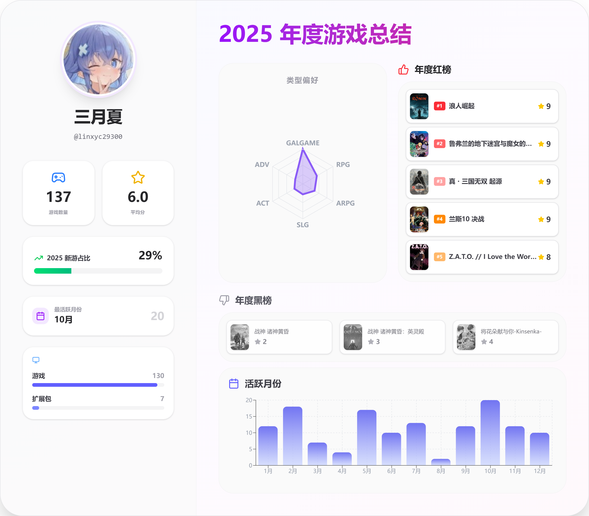

# Bangumi Annual Game Report

  <a href="#中文">中文</a> | <a href="#english">English</a>

---

# Bangumi年度游戏报告生成器

一个为 Bangumi 用户生成个性化年度游戏收藏数据分析报告的 Web 应用。

> ⚠️ **本网站于 2025 年底部署上线，现已为节约成本暂时下线**

## 📊 项目简介

本项目通过分析 Bangumi 用户的游戏收藏数据，自动生成个性化的年度游戏报告。系统从 Bangumi API 获取用户数据，进行多维度统计分析，并以可视化图表的形式展示用户的游戏偏好、活跃度、评分分布等信息。

## 🖼️ 项目展示

## 🛠️ 技术栈

- **前端**: React 19 + TypeScript + Tailwind CSS
- **数据可视化**: Recharts
- **后端**: Python + FastAPI

---

# Bangumi Annual Game Report

A web application that generates personalized annual game collection data analysis reports for Bangumi users.

> ⚠️ **This website was deployed in late 2025 and has been temporarily taken offline to reduce costs**

## 📊 Project Overview

This project analyzes Bangumi users' game collection data and automatically generates personalized annual game reports. The system fetches user data from the Bangumi API, performs multi-dimensional statistical analysis, and presents the results through interactive visualizations showing game preferences, activity levels, rating distributions, and more.

## 🖼️ Project Screenshot

## 🛠️ Tech Stack

- **Frontend**: React 19 + TypeScript + Tailwind CSS
- **Data Visualization**: Recharts
- **Backend**: Python + FastAPI

---

